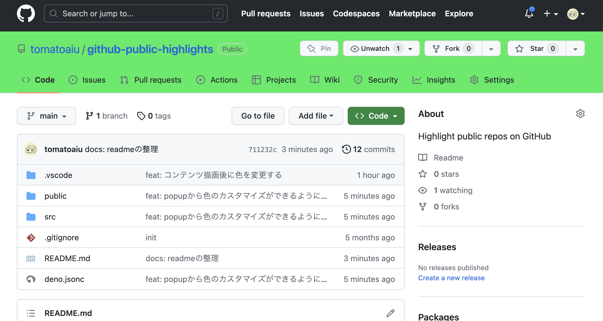

# github-public-highlights

This tool is a Chrome extension that colors GitHub repositories based on whether they are public or private.

|public repository|private repository|
|:--|:--|
|||

## Build

```shell
deno task build
```

Build output `/dist`

## Template by

- [https://github.com/keyhole0/ChromeExtensionTemplateForDeno](https://github.com/keyhole0/ChromeExtensionTemplateForDeno)
