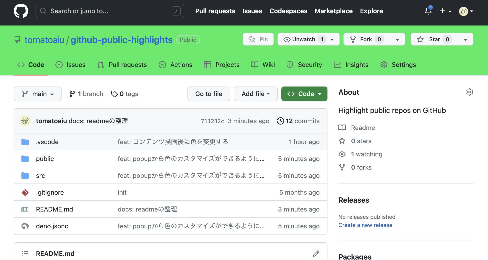
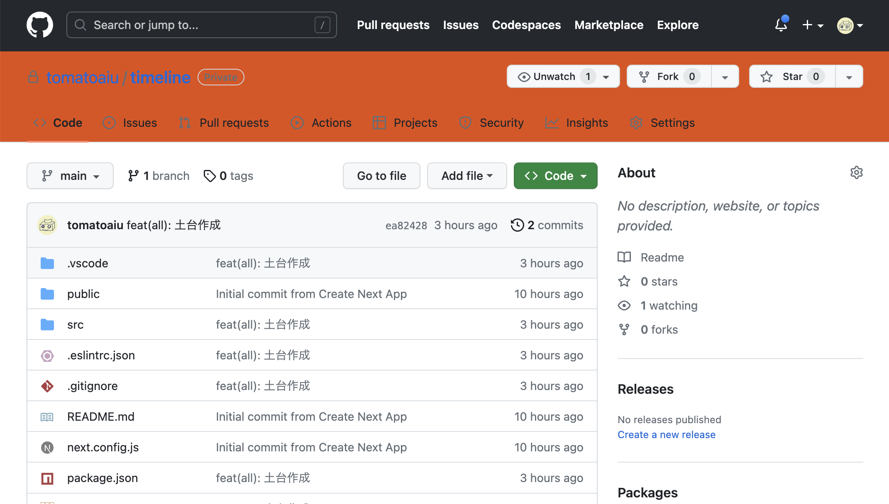

# GitHub Public Highlights

A Chrome extension that colors GitHub repository headers based on whether the repository is public or private.

| public repository                        | private repository                         |
| :--------------------------------------- | :----------------------------------------- |
|  |  |

## Development

Node.js and pnpm are pinned with [mise](https://mise.jdx.dev/).

```sh
mise install
pnpm install --frozen-lockfile
pnpm dev
```

Build the production extension and load `.output/chrome-mv3` from `chrome://extensions` with **Load unpacked**:

```sh
pnpm build
```

Run the extension against GitHub with headless `agent-browser`:

```sh
pnpm browser:install # Only when Chrome for Testing is not installed
pnpm test:browser
```

Run all required checks or create a distribution ZIP:

```sh
pnpm check
pnpm zip
```

## Dependency safeguards

- Node.js, pnpm, and direct dependencies use exact versions.
- pnpm revalidates locked packages against the repository policy.
- Packages published less than 24 hours ago and transitive dependencies from external URLs are rejected.
- CI uses the frozen lockfile and pins GitHub Actions to full commit SHAs.

## Releases

Release Please derives versions from Conventional Commit titles.
Merging a release pull request publishes the checked ZIP, its SHA-256 checksum, and signed build provenance in an immutable GitHub Release.
The first `v0.1.0` release is started manually from the **Release** workflow.

```sh
gh release download v0.1.0
gh release verify v0.1.0
gh attestation verify github-public-highlights-0.1.0-chrome.zip \
  --repo tomatoaiu/github-public-highlights
```

## Acknowledgment

The original project used [ChromeExtensionTemplateForDeno](https://github.com/keyhole0/ChromeExtensionTemplateForDeno) as its template.

## License

[MIT](LICENSE)

See [THIRD_PARTY_NOTICES.txt](public/THIRD_PARTY_NOTICES.txt) for bundled third-party software notices.
